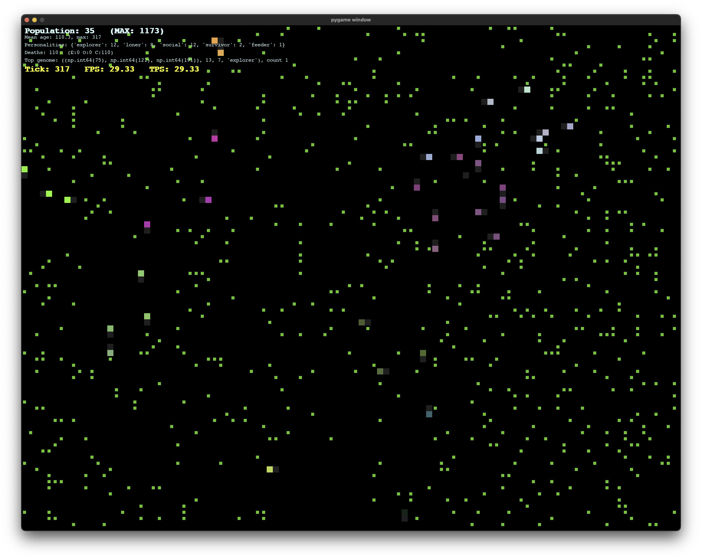

# Evolutionary Agent Simulation



A fully interactive, open-source simulation of evolving agents with neural brains and population dynamics.
Agents learn, die, mutate, and reproduce in a live grid world.  
All core logic, visualization, and adaptation mechanisms are transparent, hackable, and minimal.

## Features

- **Real-time simulation:** Watch hundreds of agents move, eat, die, and reproduce on a live grid.
- **Neural brains:** Each agent has an LSTM-based neural network controlling its decisions.
- **Sensory system:** Agents sense food, other agents, friends (by color group), map edges, and more.
- **Evolution:** Offspring inherit mutated traits—radius, color, personality, and neural weights.
- **Adaptive resource control:** The world dynamically balances food, crowding, and population pressure to avoid
  deadlocks and extinction.
- **Rich UI:** Interactive Pygame window, agent tooltips, real-time stats, and on-the-fly pausing/inspection.
- **Minimal dependencies:** Pure Python 3.8+; only needs `pygame`, `numpy`, `torch` for brain; no cloud, no database, no
  black-box.

## Quick Start

### 1. Install Requirements

```bash
pip install pygame numpy torch
```

### 2. Run the Simulation

```bash
python -m src.main
```

or, if your layout is different:

```bash
python main.py
```

### 3. Controls

- **Space:** Pause/unpause the simulation at any moment.
- **Mouse click:** Pin or unpin an agent for detailed tooltip (shows genome, sensors, stats, radii).
- **Hover:** See detailed info on any agent just by moving the mouse.
- **Window close:** Clean shutdown, population stats are printed to the console.

### 4. What You See

- **Agents:** Colored squares, each an independent evolving entity.
- **Food:** Green dots, scattered across dynamically changing "food zones".
- **Agent history:** Trails and last-visited fields highlighted for each agent.
- **Overlays:** Live stats on population, deaths, personalities, top genome, and simulation FPS/TPS.

---

## Customization and Hacking

- **Configuration:** See [`src/config.py`](src/config.py).  
  Change neural net size, sensory range, mutation rates, grid size, and more.
- **Brains:** Modify [`src/batched_lstm.py`](src/batched_lstm.py) or agent logic for new behavior types.
- **Senses:** Add more sensors or biases in [
  `src/agent_components/agent_senses.py`](src/agent_components/agent_senses.py).
- **UI:** Tweak or extend overlay rendering in [`src/simulation.py`](src/simulation.py).
- **Resource Logic:** The balancer in [`src/population_balancer.py`](src/population_balancer.py) auto-tunes world
  parameters, but you can replace it.

---

## Sample: Agent API

```python
agent = Agent(sim, x=5, y=10, color=(128, 0, 128), food_radius=4, agent_radius=3, personality="explorer")
agent.sense(food_grid, agent_grid)  # Update agent's sensory buffer
inputs = agent.get_inputs()  # Ready for neural net
agent.apply_move(action, h, c, taken, trace_map, tick)  # Move with RNN state
agent.eat(food_set)  # Try to eat food at current position
if agent.can_reproduce():
    child = agent.reproduce()
    # place child in world
```

---

## FAQ

**Q: Can I run this on CPU only?**  
A: Yes. The code detects available hardware and runs everywhere PyTorch supports.

**Q: Can I add my own agent "species" or behaviors?**  
A: Yes. Add/extend personality logic, sensors, or neural net layers. Each agent is independent.

**Q: Is this RL? GA?**  
A: It's a minimal hybrid. Agents have fixed neural brains, but reproduce with mutation—survival is via fitness, not
gradient descent.

**Q: How fast is it?**  
A: 200–1000 agents at 30 FPS on a laptop, depending on your hardware and PyTorch backend.

**Q: How do I save/restore population state?**  
A: Not implemented by default. PRs welcome! (Use Python's `pickle` to serialize, see open issues.)

---

## Contributing

Open source means **everything is up for improvement**.

- Issues, suggestions, PRs, wild ideas: **welcome**.
- Code is designed for **clarity and hackability** over style.
- The test harness is intentionally minimal—bring your own.

---

## License

MIT License — free for all use, research, and modification.  
See [LICENSE](LICENSE) for details.

---

**Build the simulation you want to see in the world.**

